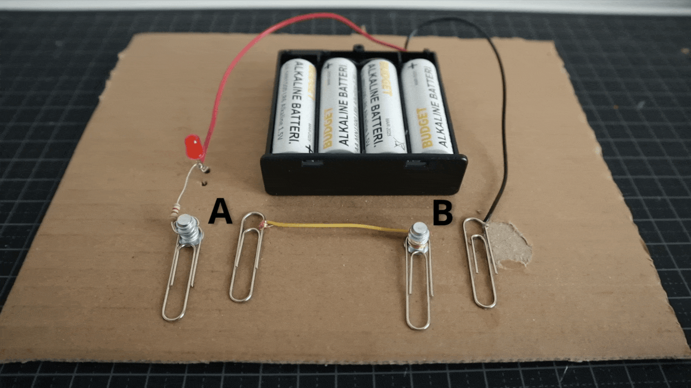

[“Exploring How Computers Work” by Sebastian Lague](https://youtu.be/QZwneRb-zqA "source")

---


---


Image written captions goes here lorem ipsum dolor sit amet

---

## Test heading 2

paragraph

- Item A
- Item Abc
- Item Xyz

---

1. Item A
2. Item Abc
3. Item Xyz

---

paragraph with a [link](https://example.com)

> A citation goes here

---

A `console.log("hello, world")` goes **here**, not _there_

---

```html
<p id="paragraph">
  Testing syntax highlighting
</p>
```

---

```js
function greet(name) {
  console.log(`Hello ${ name ? name : 'there' }`); // And a comment at 80 chars
}
```

---

| Tables   |      Are      |  Cool |
|----------|:-------------:|------:|
| col 1 is |  ~~left-aligned~~ | <span>$1600</span> |
| col 2 is |    **centered**   |   $12 |
| col 3 is | right-aligned |    $1 |


[My Portfolio](https://vsueiro.com "source")

---

&nbsp; | &nbsp;
------ | -----
Stuff  | More things
**Stuff**  | More _things_ yay
 | <- Image here

---

A | B | C
:-:|:-:|:-:
 |  | 

---

Several species of <mark>salamander</mark> inhabit the temperate rainforest of the Pacific <del>Southeast</del><ins>Northwest</ins>.